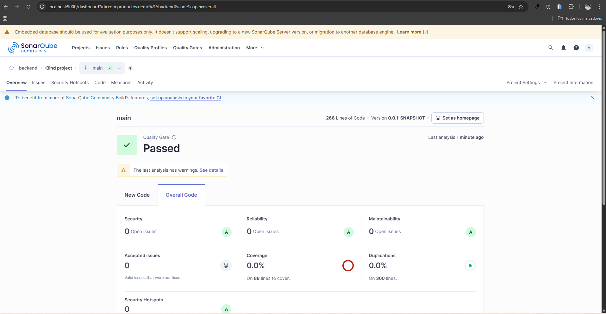

Backend – CRUD de Productos

Tecnologías: Java 17 · Spring Boot 4.0.0 · MySQL · Maven

Este backend forma parte de mi proyecto Full Stack con Angular + Spring Boot.
Su función es proveer una API REST para la gestión de productos, incluyendo operaciones de creación, lectura, actualización, activación/desactivación y ajuste de inventario.

📌 Características principales

API REST completamente funcional

CRUD de productos

Validaciones de negocio (precio, existencias, nombre único)

Conexión a base de datos MySQL

Arquitectura basada en capas (Controller, Service, Repository)

Manejo de excepciones

Uso de Data JPA para persistencia

Respuestas en formato JSON

*Tecnologías utilizadas
Componente	Versión
Java	17
Spring Boot	4.0.0
Maven	3.8+
MySQL	8+
Lombok	Opcional
Spring Data JPA	Incluido

* Estructura del proyecto
backend/
 ├── src/
 │   ├── main/
 │   │   ├── java/com/miapp/productos/
 │   │   │   ├── controller/
 │   │   │   ├── service/
 │   │   │   ├── repository/
 │   │   │   └── model/
 │   │   └── resources/static/templates
 │   │       └── application.properties
 │   │
 │   └──test/java/com/productos/demo
 │      └──DemoApplicationTests
 │
 └── pom.xml

*Configuración de la base de datos

En el archivo application.properties:

spring.datasource.url=jdbc:mysql://localhost:3306/mi_base_de_datos
spring.datasource.username=root
spring.datasource.password=*********

spring.jpa.hibernate.ddl-auto=update
spring.jpa.show-sql=true
spring.jpa.properties.hibernate.format_sql=true
spring.jpa.database-platform=org.hibernate.dialect.MySQLDialect

*Endpoints principales

 1-Listar todos los productos
GET /productos

2- Obtener un producto por ID
GET /productos/{id}

3- Crear un producto
POST /productos

4- Actualizar un producto
PUT /productos/{id}

5- Activar/Desactivar producto
PATCH /productos/{id}/activar

 Ajustar inventario
POST /productos/{id}/ajustar

*Pruebas de API

Puedes probar la API con herramientas como:

Postman

Ejemplo:

POST http://localhost:8080/productos

Key: Content-Type
Value: application/json

Content-Type: application/json

{
  "nombre": "Pelota",
  "marca": "MarcaX",
  "categoria": "Juguetes",
  "precio": 150.0,
  "existencias": 20,
  "activo": true
}
[Imagen de demostración](image.png)

*Errores encontrados durante el desarrollo

1-Error en el puerto de MySQL

Al principio, la aplicación Spring Boot no podía conectarse a la base de datos y al intentar arrancarla, en la consola aparecía un error tipo:

Communications link failure
o
Connection refused

Esto hacía que el backend no iniciara correctamente.

Dónde ocurría:
El problema estaba en el archivo application.properties, donde configuraba la conexión a MySQL:

spring.datasource.url=jdbc:mysql://localhost:3307/mi_base
spring.datasource.username=root
spring.datasource.password=1234

En este caso, el puerto configurado (3307) no coincidía con el puerto real donde MySQL estaba escuchando.

Cómo lo solucioné:

Verifiqué el puerto correcto en MySQL Workbench o mediante consola con:

SHOW VARIABLES LIKE 'port';

Actualicé el application.properties con el puerto correcto (3306, que es el por defecto):

spring.datasource.url=jdbc:mysql://localhost:3306/mi_base_de_datos
spring.datasource.username=root
spring.datasource.password=*********

Reinicié la aplicación y la conexión a la base de datos se estableció correctamente, permitiendo que el backend arrancara sin problemas.

2-Error 400 al crear un producto

Al principio, al intentar crear un producto usando el endpoint POST /productos, me regresaba un error 400 (Bad Request). Esto pasaba incluso cuando creía que el JSON que enviaba estaba correcto.

Revisando el código, me di cuenta de que el problema estaba en las validaciones dentro del ProductoService, en el método crearProducto. Allí había reglas como:

if (producto.getPrecio() == null || producto.getPrecio() <= 0) {
    throw new IllegalArgumentException("El precio debe ser mayor que 0");
}
if (producto.getExistencias() == null || producto.getExistencias() < 0) {
    throw new IllegalArgumentException("Las existencias deben ser mayor o igual a 0");
}
if (productoRepository.existsByNombre(producto.getNombre())) {
    throw new IllegalArgumentException("Ya existe un producto con este nombre");
}
if (producto.getActivo() == null) {
    producto.setActivo(true);
}

Qué pasaba:

Si enviaba un producto con precio nulo o menor que 0, el backend lanzaba excepción y Spring devolvía 400.

Lo mismo ocurría si las existencias eran nulas o negativas, o si el nombre del producto ya existía en la base de datos.

También había problemas si el campo activo no se enviaba en el JSON.

Cómo lo solucioné:

Agregué validaciones explícitas en el método crearProducto para manejar todos estos casos y devolver mensajes claros.

if (producto.getPrecio() == null || producto.getPrecio() <= 0) {
    throw new IllegalArgumentException("El precio debe ser mayor que 0");
}

Inicialicé activo por defecto en true cuando el cliente no enviaba ese valor.

if (producto.getActivo() == null) {
            producto.setActivo(true); // Por defecto activo
        }

Con esto, cualquier producto enviado con datos correctos se crea sin problema, y si algún dato es inválido, ahora recibo un mensaje de error específico en lugar de un 400 genérico.

Resultado:

Ahora puedo crear productos correctamente usando JSON como este:

{
  "nombre": "Pelota",
  "marca": "MarcaX",
  "categoria": "Juguetes",
  "precio": 150.0,
  "existencias": 20,
  "activo": true
}

Y si algo no cumple las reglas, el backend me dice exactamente qué campo está mal.

3-Error al traer un producto para editar

Al principio, al intentar obtener un producto usando el endpoint GET /productos/{id} para editarlo, la aplicación podía lanzar una excepción genérica si había un problema al recuperar los datos de la base. Esto hacía que la edición no fuera confiable y dificultaba identificar el error.

Dónde ocurría:
En el método obtenerProducto del ProductoService:

public Optional<Producto> obtenerProducto(Long id) {
    return productoRepository.findById(id); // Si algo fallaba, podía generar error genérico al usar el producto
}

Si se intentaba acceder directamente al producto sin manejar el Optional, podía lanzarse un error inesperado.

Cómo lo solucioné:

Se manejó el Optional usando orElseThrow() en los métodos que requerían el producto para edición:

Producto productoExistente = productoRepository.findById(id)
        .orElseThrow(() -> new IllegalArgumentException("Error al obtener producto"));

Resultado:
Ahora, al intentar editar un producto, cualquier problema al traer los datos devuelve un mensaje claro, evitando errores genéricos y facilitando la depuración y la experiencia del usuario.

*Fuentes de apoyo utilizadas

Durante el desarrollo se consultaron:

Videos de YouTube sobre Spring Boot + MySQL

Videos sobre CRUD con productos

Asistencia de IA para resolver dudas o errores específicos de código

*Cómo ejecutar el backend

Clonar el repositorio

Crear la base de datos en MySQL:

CREATE DATABASE mi_base_de_datos;

Actualizar usuario/contraseña en application.properties

Ejecutar:

mvn spring-boot:run

API disponible en:

http://localhost:8080/productos

📝 Jose Francisco Morales Mejorada 

Proyecto desarrollado como práctica de aprendizaje utilizando Java 17, Angular 17, Spring Boot 4 y MySQL.

*Prueba SonarQube
Se realizo la prueba en SonarQube con resultados positivos y los esperados.
comparto evidencia: 